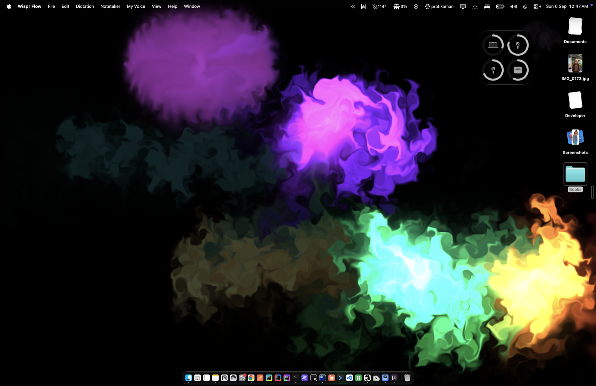

# Eddy

Eddy turns your Mac's desktop into a slow-moving pool of coloured smoke that dances to
whatever you're listening to.

## What it does

- **Lives behind your icons.** Eddy sits where your wallpaper normally is. Your files,
  folders and widgets stay exactly where they are, on top of it.
- **Never stands still.** Three drifting plumes of colour keep swirling and mixing even
  when your Mac is silent.
- **Moves to your music.** Play anything, in any app, with speakers or headphones. Bass
  makes the smoke bloom, every beat sets off a burst, high notes throw off little sparks,
  and the colours slowly shift with the melody.
- **Knows when to rest.** When your desktop is completely covered by windows, Eddy goes
  quiet so it doesn't eat your battery.

## Installing

1. [Download Eddy](https://github.com/pratikaman/Eddy/releases/latest/download/Eddy.zip).
2. Double-click the downloaded file to unpack it, then drag **Eddy** into your
   **Applications** folder.
3. Open Eddy. The first time, your Mac may say it can't check the app for malicious
   software. That's because Eddy is a homemade app rather than one from the App Store.
   Open **System Settings → Privacy & Security**, scroll down, click **Open Anyway**, and
   open Eddy once more.
4. Your Mac will ask whether Eddy may listen to your computer's audio. Click **Allow**.
   This is how Eddy hears the music. It never records or saves anything, and nothing
   ever leaves your Mac.

That's it. Your desktop should already be moving.

## Using it

A small wave icon appears in the menu bar at the top of your screen. Click it to:

- **Pause / Resume** the smoke.
- **React to Audio**: switch this off if you just want the calm drift without the music.
- **Launch at Login**: have Eddy start every time you turn on your Mac.
- **Quit Eddy**: your usual wallpaper comes straight back.

## Good to know

- Works on Macs with Apple silicon running macOS 14.4 or newer.
- Eddy paints on top of your wallpaper but never changes it. Quit Eddy and your picture
  is right where you left it.
- If you have more than one screen, each one gets its own pool of colour.
- Nothing is recorded, stored or sent anywhere. Eddy only listens to the rhythm of what's
  playing, in the moment, and forgets it instantly.

Curious how it works or want to change how it looks? See [BUILDING.md](BUILDING.md).
